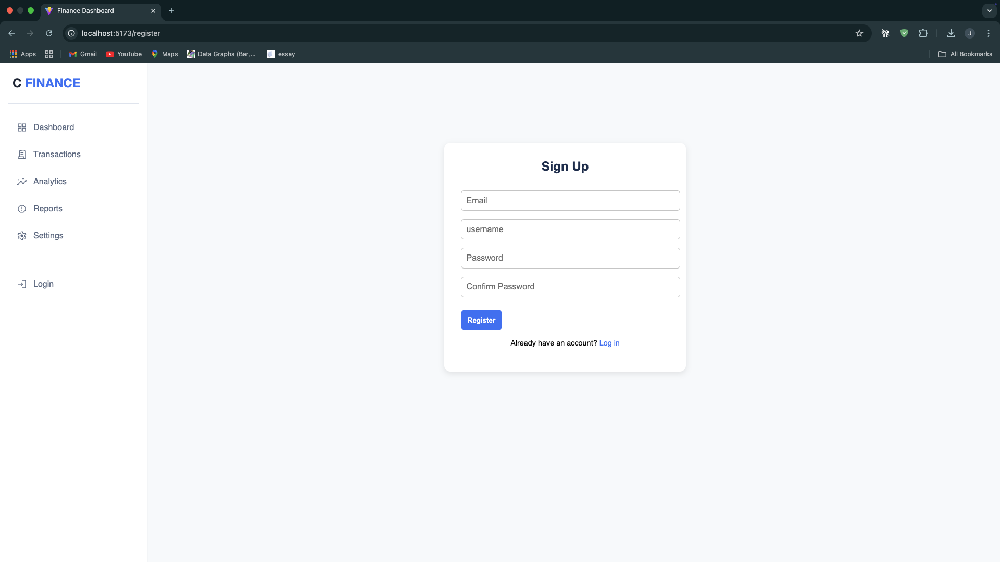

# Vue 3 + Vite

# Financial Tracker

## Overview
Our Financial Tracker is a web application designed to allow users to manage their finances in a clear and organized layout comprising of their income, expense, and net worth information. 

--

## Features
1. Login: User starts by loging in to the web app (or register if they didn't sign up) 
2. Dashboard: Inputs their Income title/value and Expense title/value, while displaying Total Income, Total Expenses and Net Worth. 3. Transaction: Views users' complete financial history, consisting of income and expenses values. Users can also manage their entries with options to edit or delete each individual transactions. 
4. Analytics: Provides a visual representation of financial data through pie and bar charts, offering insights into income and expenses categorized by time periods by month, year, or all time.

## **Register**

## **Login**

## **Dashboard**

## **Transaction**

## **Analytics**

This template should help get you started developing with Vue 3 in Vite. The template uses Vue 3 `<script setup>` SFCs, check out the [script setup docs](https://v3.vuejs.org/api/sfc-script-setup.html#sfc-script-setup) to learn more.

Learn more about IDE Support for Vue in the [Vue Docs Scaling up Guide](https://vuejs.org/guide/scaling-up/tooling.html#ide-support).