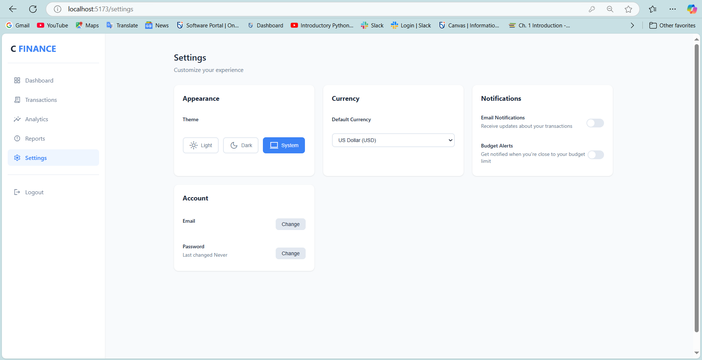

# Financial Tracker

## Overview
Our Financial Tracker is a web application designed to allow users to manage their finances in a clear and organized layout comprising of their income, expense, and net worth information. 


## How to Run

## Step 1
- Clone the repository:
```bash
git clone https://github.com/georgenakuje/WebDev-FinanceDashboard.git
```
## Step 2
- Install npm (part of Node bundle) in case it's not installed
```bash
https://nodejs.org/en
```
## Step 3
- With Node installed, make sure you install all dependencies required for this web app
```bash
npm install
```
## Step 4
- Once you've installed all dependencies, run the front-end and back-end to access the website in full
```bash
npm run start
```
## Step 5
- Click on the link directing you to the Financial Tracker website
```bash
http://localhost:5173/
```
## Step 6
- You're now on the website, to get started, register an account then login.


## Features
1. Login: User starts by loging in to the web app (or register if they didn't sign up) 
2. Dashboard: Inputs their Income title/value and Expense title/value, while displaying Total Income, Total Expenses and Net Worth.
3. Transaction: Views users' complete financial history, consisting of income and expenses values. Users can also manage their entries with options to edit or delete each individual transactions.
4. Analytics: Provides a visual representation of financial data through pie and bar charts, offering insights into income and expenses categorized by time periods by month, year, or all time.
5. Settings: Helps customize users experience with the website (i.e. theme settings, change email/password, notifications, and default currency)


## **Login**


## **Dashboard**


## **Transaction**


## **Analytics**


## **Setting**



# Vue 3 + Vite
This template should help get you started developing with Vue 3 in Vite. The template uses Vue 3 `<script setup>` SFCs, check out the [script setup docs](https://v3.vuejs.org/api/sfc-script-setup.html#sfc-script-setup) to learn more.

Learn more about IDE Support for Vue in the [Vue Docs Scaling up Guide](https://vuejs.org/guide/scaling-up/tooling.html#ide-support).